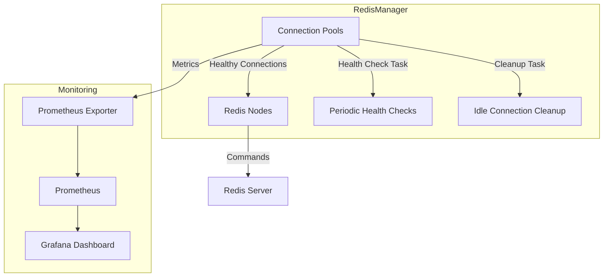

# **Redis Manager**
[](https://pypi.org/project/redis-manager/)  
[](https://pypi.org/project/redis-manager/)  
[](https://pypi.org/project/redis-manager/)


---

## **Features**
- **Asynchronous & High-Performance**: Non-blocking operations with `asyncio`.
- **Auto-Healing Connection Pools**: Recover from failures without service restarts.
- **Context Manager**: Prevent resource leaks in high-concurrency systems.
- **Real-Time Monitoring**: Prometheus metrics for insights and debugging.
- **Redis Cluster Support**: Simplified handling of distributed nodes.

[➡️ View All Features](docs/features.md)

---

## **Quickstart**

### Install Redis Manager:
```bash
pip install redis-manager
```

### Example Code:
```python
from redis_manager.redis_manager import RedisManager

async def main():
    manager = RedisManager(connection_pools_per_node_at_start=2)
    await manager.add_node_pool("redis://localhost")
    manager.start_cleanup()

    # Note: The RedisManager can be wrapped in a try/catch block to gracefully handle exceptions
    # such as connection errors or unavailability of Redis nodes.
    async with manager.get_client("redis://localhost") as client:
        await client.set("key", "value")
        value = await client.get("key")
        print(value)

    # Stop tasks and close pools
    manager.stop_health_checks()
    manager.stop_cleanup()
    await manager.close_all_pools()
```

---

## **Architecture Diagram**



---

## **Documentation**
- [➡️ Learn More About Architecture](docs/architecture.md)
- [➡️ Why Redis Manager?](docs/why_redis_manager.md)
- [➡️ Usage Examples](docs/usage.md)
- [➡️ API Documentation](docs/REDIS_MANAGER_API_DOCS.md)
- [➡️ Packaging](docs/packaging.md)

---

## **Acknowledgments**
- **Redis**: The powerful in-memory data structure store used for fast data storage and retrieval.
- **Asyncio**: Python's asynchronous programming framework, enabling efficient and scalable async operations.
- **Bitnami Redis Cluster Docker Images**: Used in testing and integration for seamless containerized Redis cluster setups.
- **Prometheus**: Open-source monitoring and alerting toolkit for metrics collection and visualization.
- **Grafana**: The leading open-source analytics and interactive visualization tool, providing rich dashboards for monitoring Redis performance and related metrics.

---

## **Changelog**
Detailed changelog in [CHANGELOG.md](CHANGELOG.md).

---

## **License**
Licensed under the MIT License. See [LICENSE](LICENSE) file for more details.

---

## **Contributing**
We welcome contributions! Please see our [Contributing Guide](CONTRIBUTING.md) and [Code of Conduct](CODE_OF_CONDUCT.md) to get started.

---

**Initially Developed by [Youssef Khaya](https://www.linkedin.com/in/youssef-khaya-88a1a128)**
