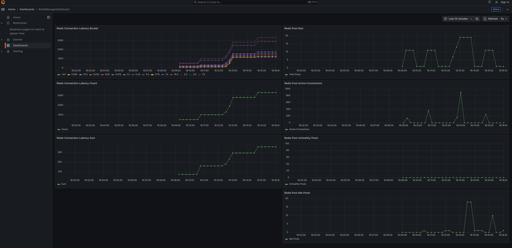

---

# **Redis Manager**


Redis Manager is a Python-based library designed for **efficient, asynchronous**, and scalable connection pool management for Redis and Redis Cluster environments. It is built with compatibility for **Redis 5.0 and above**, leveraging the latest features to provide high-performance operations and dynamic scaling. This makes it an ideal choice for **microservices**, **large-scale systems**, and **real-time applications**.

### **Why Redis Manager?**

- **Asynchronous and High-Performance**: Redis Manager is fully asynchronous, allowing non-blocking I/O operations. This significantly improves performance in systems with high concurrency, as it enables efficient resource utilization compared to traditional synchronous libraries.
  
- **Auto-Healing Connection Pool**: Unlike traditional services where a service restart is required if a Redis connection is disrupted, Redis Manager provides an **auto-healing connection pool**. The pool is initialized as a single instance when the service starts and is referenced across the service. It automatically recovers from connection failures, ensuring continuous availability without restarting the service.

- **Optimized with `asyncio.Condition`**: Redis Manager uses `asyncio.Condition` to manage and synchronize state changes within the connection pool. This enables fine-grained control over asynchronous wait conditions, ensuring:

  - **Efficient Resource Locking**: Only tasks that require updates to shared resources are delayed, minimizing contention and maximizing throughput.
  - **Fine-Grained State Management**: Pool states are updated in a coordinated manner, ensuring consistency even under high-concurrency conditions.
  - **Reduced Latency**: By waking up only the necessary waiting tasks, `asyncio.Condition` improves response times in dynamic and real-time environments.

- **Context Manager for Resource Safety**: Redis Manager exposes a **context manager**, ensuring proper resource cleanup and management. This guarantees that connections are released cleanly, minimizing resource leaks and improving stability, especially in high-throughput systems.

- **Full Redis 5.0+ Feature Support**: Redis Manager supports all the features introduced in Redis 5.0, including Streams, advanced cluster modes, and more. This ensures compatibility with modern Redis capabilities for high-performance, distributed environments.

- **Customizable and Validated Configuration**: The pool manager exposes a comprehensive interface for configuring Redis and Redis Cluster options. Internal validation ensures that configurations are robust and error-free.

### **Key Benefits**

- **Improved Resilience**: Prevent service downtime caused by connection disruptions.
- **Optimized for Microservices**: Simplifies Redis integration for scalable, distributed systems.
- **Ease of Use**: Streamlined API with built-in validation for quick and reliable configuration.
- **Supports Real-Time Use Cases**: Ideal for event-driven architectures and applications requiring low-latency data access.
- **Enhanced Resource Management**: The context manager ensures proper lifecycle management, reducing the risk of resource leaks.
- **Concurrency Efficiency**: By leveraging `asyncio.Condition`, Redis Manager provides precise synchronization and better performance in asynchronous environments.


---

### **Features**

- **Dynamic Connection Pooling**: Automatically manages connection pools based on workload, ensuring efficient resource utilization and responsiveness under high concurrency.

- **Cluster Support**: Seamlessly handles Redis Clusters with multiple nodes, optimizing connection usage and load distribution for distributed environments.

- **Timeout Handling**: Ensures robust operations by intelligently managing timeouts under varying load conditions, preventing service disruptions.

- **Customizable Settings**: Easily configure pool size, timeouts, cluster settings, and more through a streamlined and validated API interface.

- **Lightweight and Fast**: Built on **asyncio** for asynchronous, non-blocking operations, providing significant performance gains in high-concurrency systems.

- **Comprehensive Monitoring and Metrics**:
  - **Real-Time Insights**: Tracks pool health, connection usage, and active calls for each Redis node.
  - **Error Tracking**: Logs and monitors connection failures, unhealthy pools, and retries to quickly identify and resolve issues.
  - **Performance Metrics**: Provides detailed insights into latency, throughput, and resource utilization.
  - **Event Hooks**: Allows integration with monitoring systems like Prometheus for custom alerts and dashboards.
  
- **Comprehensive Testbench**: Includes a detailed testbench that simulates real-world workloads, validates stability, and provides insightful metrics on connection usage, pool health, and performance trends.

---

## **RedisManager Architecture**

The **RedisManager** dynamically manages multiple Redis connection pools across nodes, ensuring optimal connection health, resource usage, and operational efficiency. This class includes features like periodic health checks, idle connection cleanup, and Prometheus metrics for monitoring.

### **Architecture Overview**
- **RedisManager**:
  - Manages Redis connection pools for multiple nodes.
  - Performs periodic health checks to maintain reliable connections.
  - Cleans up idle connections to save resources.
  - Reports metrics to Prometheus for real-time monitoring.
- **RedisConnection**:
  - Represents an individual connection to a Redis node.
  - Handles initialization, health checks, and lifecycle management.
  - Supports cluster and non-cluster Redis configurations.

### **Mermaid Diagram**
---
The following diagram illustrates the interactions between components:


---

### **How It Works**
---
1. **Connection Pools**:
   - Each Redis node has a set of managed connection pools initialized and maintained by the `RedisManager`.
   - Pools dynamically expand or shrink based on usage.

2. **Health Checks**:
   - Periodically verifies the health of all connection pools.
   - Replaces unhealthy connections with new ones.

3. **Idle Connection Cleanup**:
   - Removes idle connections from pools to optimize resource usage.

4. **Metrics Monitoring**:
   - Exposes metrics such as the number of active connections, idle connections, and latency.
   - Prometheus collects these metrics, which are visualized in Grafana.

---

### **Example Code**
---

Here’s a quick example to demonstrate using the RedisManager:

```python
import asyncio
from redis_manager.redis_manager import RedisManager, NoHealthyPoolsException

async def main():
    manager = RedisManager(connection_pools_per_node_at_start=2)

    # Add a Redis node
    await manager.add_node_pool("redis://localhost")

    # Start cleanup
    manager.start_cleanup()

    # Use a Redis connection
    try:
        async with manager.get_client("redis://localhost") as client:
            await client.ping()  # Example operation
    except NoHealthyPoolsException:
        print("No healthy connections available")

    # Stop tasks and close pools
    manager.stop_health_checks()
    manager.stop_cleanup()
    await manager.close_all_pools()

asyncio.run(main())
```
## **Requirements**

- Python 3.8 or later
- Redis 5.0 or later
- Dependencies listed in [`requirements.txt`](requirements.txt)

---

## **Installation**

```bash
# Clone the repository
git clone https://github.com/yokha/redis-manager

# Navigate to the project directory
cd redis-manager

# Install dependencies
pip install -r requirements.txt -r dev-requirements.txt
```

---

## **Usage**

### **Basic Example**

```python
from redis_manager.redis_manager import RedisManager

async def main():
    manager = RedisManager(connection_pools_per_node_at_start=2, max_connection_size=100)

    # Add a Redis node pool
    await manager.add_node_pool("redis://localhost:6379")

    # Start cleanup
    manager.start_cleanup()

    # Use the manager pool. Or with try block ...
    async with manager.get_client("redis://localhost:6379") as client:
        await client.set("key", "value")
        value = await client.get("key")
        print(value)

    # Cleanup
    await manager.close_all_pools()

if __name__ == "__main__":
    import asyncio
    asyncio.run(main())
```
---

## **Detailed API Documentation**

For a deeper understanding of the library's internals and usage, refer to the API documentation for each class:

- **[RedisManager](docs/REDIS_MANAGER_API_DOCS.md)**
- **[RedisConnection](docs/REDIS_CONNECTION_API_DOCS.md)**
---

## **Integration with Redis Cluster**

Redis Manager supports Redis Cluster environments out of the box:

```python
from redis_manager.redis_manager import RedisManager
from redis.cluster import ClusterNode

async def main():
    redis_cluster_nodes = [
        ClusterNode("localhost", 7000),
        ClusterNode("localhost", 7001),
        ClusterNode("localhost", 7002),
    ]
    manager = RedisManager(use_cluster=True, startup_nodes=redis_cluster_nodes)

    # Add a Redis node pool
    await manager.add_node_pool("redis://localhost:7000")

    # Start cleanup
    manager.start_cleanup()

    # Use the manager pool. Or with try block ...
    async with manager.get_client("redis://localhost:7000") as client:
        await client.set("cluster_key", "cluster_value")
        value = await client.get("cluster_key")
        print(value)

    await manager.close_all_pools()
```

---

## **Testing**

### Run Unit Tests

```bash
make test
```

### Run Integration Tests

```bash
make integration
```

### Coverage Report

Generate a test coverage report:

```bash
make cov
```

---
## **Testbench**

The Redis Manager comes with a **testbench** to simulate real-world scenarios and evaluate the system's performance under load. It provides the following:

- **Metrics Visualization**: Track metrics like connection utilization, pool health, and request latency.
- **Stress Testing**: Push Redis and Redis Cluster environments to their limits with configurable workloads.
- **Automated Validation**: Ensure consistency and reliability of operations across nodes.
- **Prometheus Integration**: Export metrics for external monitoring and visualization using tools like Grafana.

```bash
# A helper text for user
make testbench-helper

# run testbench
make testbench

# cleanup
make testbench-clean
```

Visualize the performance in real-time grafana dashboards: http://localhost:3000

### Example Grafana metrics visualization


---
## Packaging/Release (Manual, Not Part of Pipeline)

The packaging and release process is manually handled via Makefile targets to ensure full control over build artifacts, testing and deployment. These targets facilitate cleaning up build artifacts, packaging the project, and releasing to Test PyPI or PyPI.

#### **Example Commands**
- **Clean up build artifacts and the virtual environment**:
  ```bash
  make clean-pkg-venv
  ```

- **Package the project**:
  ```bash
  make package
  ```

- **Release to Test PyPI**:
  ```bash
  export TWINE_USERNAME="__token__"
  # Require env var for token
  export TWINE_PASSWORD="your-test-pypi-api-token"

  make Release-pypi-test
  ```

- **Verify Release to Test PyPI**:
  ```bash
  verify-test-release
  ```

- **Release to PyPI**:
  ```bash
  export TWINE_USERNAME="__token__"
  # Require env var for token
  export TWINE_PASSWORD="your-prod-pypi-api-token"

  make Release-pypi
  ```

  - **Verify Release to PyPI**:
  ```bash
  verify-test-release
  ```

- **Tag a release version**:
  ```bash
  make tag-release
  ```

These steps ensure a clean and consistent packaging process while allowing manual oversight for final releases.

---
## Contributing

We welcome contributions from everyone! Please ensure you read and understand our [Code of Conduct](CODE_OF_CONDUCT.md) before participating.

### How to Contribute

1. **Fork** the repository.
2. **Create a new branch** for your feature or bugfix.
3. **Write tests** for your changes to ensure code quality.
4. **Submit a pull request** for review.

Thank you for helping us improve this project!

---

## **License**

This project is licensed under the MIT License. See the [LICENSE](LICENSE) file for details.

---

## **Acknowledgments**
- **Redis**: The powerful in-memory data structure store used for fast data storage and retrieval.
- **Asyncio**: Python's asynchronous programming framework, enabling efficient and scalable async operations.
- **Bitnami Redis Cluster Docker Images**: Used in testing and integration for seamless containerized Redis cluster setups.
- **Prometheus**: Open-source monitoring and alerting toolkit for metrics collection and visualization.
- **Grafana**: The leading open-source analytics and interactive visualization tool, providing rich dashboards for monitoring Redis performance and related metrics.

---
## Support and Contact

For inquiries or support, please open an issue or start a discussion on our [GitHub repository](https://github.com/yokha/redis-manager).

## **Connect with Me**
- [LinkedIn](https://www.linkedin.com/in/youssef-khaya-88a1a128)
---
**Initially Developed by [Youssef Khaya](https://www.linkedin.com/in/youssef-khaya-88a1a128)**
