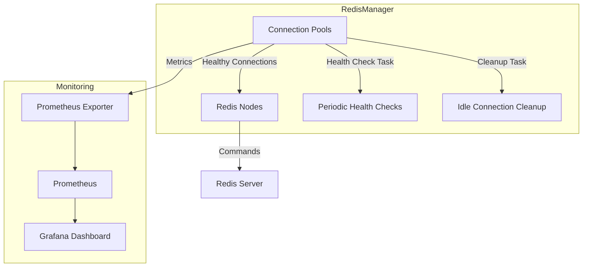

# **RedisManager Architecture**

`RedisManager` is designed to dynamically manage Redis connection pools, ensuring optimal performance and reliability. Key features include **periodic health checks**, **idle connection cleanup**, and **Prometheus metrics** for real-time monitoring.

---

## **Architecture Diagram**

---

## **Key Components**

### **1. RedisManager**
- Manages connection pools for multiple Redis nodes or clusters.
- Performs:
  - **Periodic health checks** to maintain connection reliability.
  - **Idle connection cleanup** to optimize resource usage.
- Exposes metrics for real-time monitoring.

### **2. RedisConnection**
- Represents an individual Redis connection.
- Handles:
  - **Initialization** and lifecycle management.
  - **Health checks** to ensure connection stability.

---

## **How It Works**

### **1. Connection Pools**
- Each Redis node has a dedicated set of managed connection pools.
- Pools automatically expand or shrink based on workload demands.

### **2. Health Checks**
- Regularly verifies the health of all connections in the pool.
- Automatically replaces unhealthy connections with new ones.

### **3. Idle Connection Cleanup**
- Removes idle connections from pools to reduce resource consumption and maintain efficiency.

### **4. Metrics Monitoring**
- Provides real-time metrics such as:
  - **Active connections**
  - **Idle connections**
  - **Request latency**
- Metrics are exposed via Prometheus for visualization in Grafana.

---

[🔙 Return to README](../README.md)
