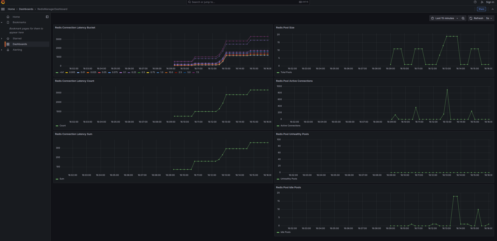

# **Example Usage and Testbench**

---

## **Example Usage**

### **Connecting to a Redis Instance**

The following example demonstrates how to use Redis Manager to connect to a Redis instance:

```python
from redis_manager.redis_manager import RedisManager

async def main():
    manager = RedisManager(connection_pools_per_node_at_start=2)

    # Add a Redis node
    await manager.add_node_pool("redis://localhost")
    manager.start_cleanup()

    # Use the connection pool
    async with manager.get_client("redis://localhost") as client:
        await client.set("key", "value")
        value = await client.get("key")
        print(value)

    # Stop tasks and close pools
    manager.stop_health_checks()
    manager.stop_cleanup()
    await manager.close_all_pools()

if __name__ == "__main__":
    import asyncio
    asyncio.run(main())
```

---

### **Connecting to a Redis Cluster**

Redis Manager seamlessly integrates with Redis Cluster environments. Here's an example:

```python
from redis_manager.redis_manager import RedisManager
from redis.cluster import ClusterNode

async def main():
    redis_cluster_nodes = [
        ClusterNode("localhost", 7000),
        ClusterNode("localhost", 7001),
        ClusterNode("localhost", 7002),
    ]

    manager = RedisManager(use_cluster=True, startup_nodes=redis_cluster_nodes)

    # Add a Redis node
    await manager.add_node_pool("redis://localhost:7000")
    manager.start_cleanup()

    # Use the cluster
    async with manager.get_client("redis://localhost:7000") as client:
        await client.set("cluster_key", "cluster_value")
        value = await client.get("cluster_key")
        print(value)

    # Stop tasks and close pools
    manager.stop_health_checks()
    manager.stop_cleanup()
    await manager.close_all_pools()

if __name__ == "__main__":
    import asyncio
    asyncio.run(main())
```

---

## **Testbench**

Redis Manager includes a comprehensive **testbench** to simulate real-world scenarios and assess the system's performance under load.

### **Capabilities**
- **Metrics Visualization**: Track metrics such as connection utilization, pool health, and request latency.
- **Stress Testing**: Simulate heavy workloads to test Redis and Redis Cluster environments.
- **Automated Validation**: Ensure reliability and consistency across nodes.
- **Prometheus Integration**: Export metrics for monitoring and visualization with tools like Grafana.

---

### **Commands**

#### **Helper Text**
```bash
make testbench-helper
```

#### **Run Testbench**
```bash
make testbench
```

#### **Cleanup**
```bash
make testbench-clean
```

---

### **Visualizing Metrics**

Metrics collected by Prometheus can be visualized using Grafana. The default dashboard is available at:

[http://localhost:3000](http://localhost:3000)

---

### Example Grafana Metrics Visualization


---

[🔙 Return to README](../README.md)
